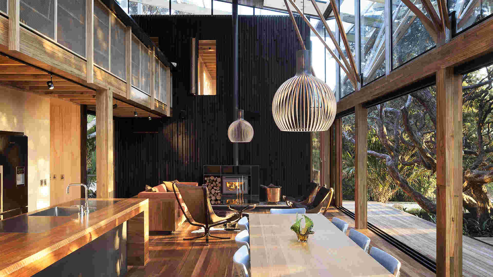
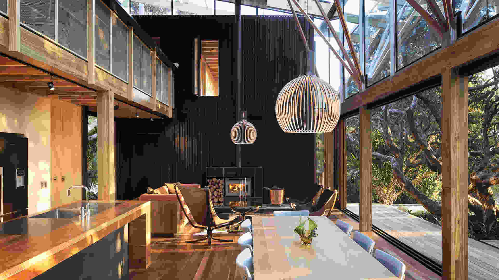

# DADI CDN

## Compression

### Overview

Image compression is generally very good, vith the best results found around in the quality range of 60-40%, where we find generated images being visually indistinguishable from the source material, on average.

For heavy compression, consider adding a gentle level of blur to the image.

### Performance examples

The dimensions of the test image and of all output images is 1920 x 1080px.

| Output quality | Image weight | Compression % | Image |
| :------------- | :----------- | :----------- | :---- |
| Original image | 2.6MB | N/A |  |
| 80% | 705KB | 73.52% |  |
| 60% | 498KB | 81.30% |  |
| 40% | 396KB | 85.13% |  |
| 20% | 283KB | 89.37% |  |
| 10% | 214KB | 91.96% |  |
| 5% | 174KB | 93.46% |  |
