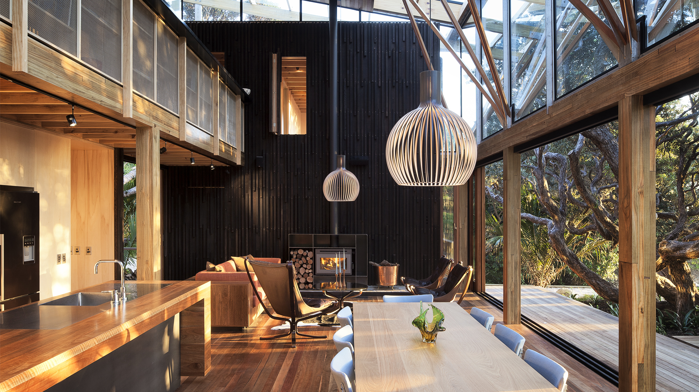
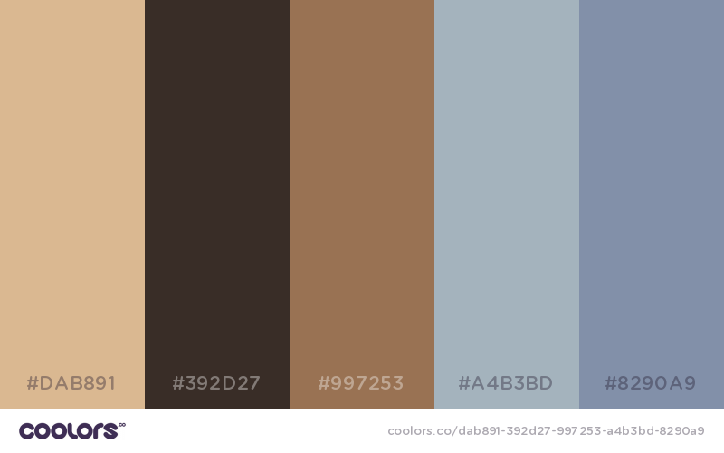

# DADI CDN

## Image data

Passing the format type `json` will return a JSON response containing all of the available information about the image requested.

**Example** `http://cdn.example.com/original.jpg?format=json`

```js
{
  "fileName": "original.jpg",
  "cacheReference": "6757e696389055a29314562056af4bc169769ec5",
  "quality": 75,
  "trim": 0,
  "trimFuzz": 0,
  "resizeStyle": "aspectfill",
  "gravity": "Center",
  "filter": "None",
  "blur": 0,
  "strip": 0,
  "rotate": 0,
  "flip": 0,
  "ratio": 0,
  "devicePixelRatio": 0,
  "format": "jpeg",
  "fileSize": 1908381,
  "primaryColor": "#3c302b",
  "palette": {
    "rgb": [
      [ 218, 184, 145 ],
      [ 57, 45, 39 ],
      [ 153, 114, 83 ],
      [ 164, 179, 189 ],
      [ 130, 144, 169 ],
      [ 112, 115, 112 ]
    ],
    "hex": [
      "#dab891",
      "#392d27",
      "#997253",
      "#a4b3bd",
      "#8290a9",
      "#707370"
    ]
  },
  "density": {
    "width": 72,
    "height": 72,
    "unit": "dpi"
  }
}
```

### Colour palette

By default, six colours are extracted from the image for the colour palette, ordered by dominance. To return fewer or more colours, pass `&colours=<number>` in the request URL.

**Example**

The following image produces the colour palette shown below.




