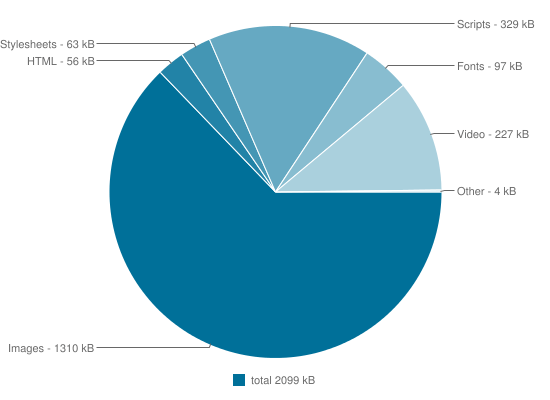

# DADI CDN

## Working with images

The weight of the average product screen is about 2MB, and about two thirds of that weight comes from images. At the same time, a huge number of people are now accessing the Internet on 3G-or-worse connections that make a 2MB screen load a bit of a horror show. Even on a fast connection, a 2MB screen can wreak havoc on your users' data plans.

Average byte per screen by content type:

Improving web performance and giving a better experience is critical to good product design.

Responsive images to the rescue! Right? Well, yes, but first we have to generate our responsive image assets. Thankfully DADI CDN makes this simple.

### Request structure

There are currently two formats for requesting assets from DADI CDN.

#### Version 1

`http(s)://www.example.com/{format}/{quality}/{trim}/{trimFuzz}/{width}/{height}/{crop-x}/{crop-y}/{ratio}/{devicePixelRatio}/{resizeStyle}/{gravity}/{filter}/{blur}/{strip}/{rotate}/{flip}/{srcData}`

#### Version 2

The second version of the request is less rigid than the original, utilising the querystring instead of the path to specify parameters. Using this structure allows specifying as many or as few options as actually required.

The basic form is:

`http(s)://www.example.com/{srcData}`

Any of the below parameters can then be added as querystring options. For example:

`http(s)://www.example.com/{srcData}?format=jpg&quality=70&width=100&height=100`

**Note:** The version of request structure is determined by the presence or absence of a querystring. If you need
to deliver an asset in it's original state with no manipulation options specified, it is required
to add a dummy querystring to the request, e.g. `http(s)://www.example.com/{srcData}?v2`.

If the querystring is not present, DADI CDN will assume the request structure is using Version 1 and the
request will fail due to the missing path parameters.

### Image manipulation options

_Note: the format of the source image is automatically identified by DADI CDN_

| Parameter     | Type          | Description |
| :------------ | :------------ | :---------- |
| format | String | Output format, e.g. 'jpg', 'png', 'json' |
| quality | Integer | 1-100, default: 75. JPEG/MIFF/PNG compression level |
| trim | Boolean | Default: 0. Trims edges that are the background color |
| trimFuzz | Float | 0-1, default: 0. Trimmed color distance to edge color, 0 is exact |
| width | Integer | Default: 0 (inherits original image size). Px |
| height | Integer | Default: 0 (inherits original image size). Px |
| crop-x | Integer | Default: 0. X position of crop area |
| crop-y | Integer | Default: 0. Y position of crop area |
| ratio | String | Default: 0.  Aspect ratio cropping. E.g. '16-9', '3-2' |
| devicePixelRatio | Integer | Default: 0. Zoom In/Out of Image |
| resizeStyle | String | Default: 0 (interpreted as 'aspectfill'). Options: 'aspectfill', 'aspectfit', 'fill', 'crop' |
| gravity | String | Default: 0 (interipted as 'none'). Used to position the crop area when resizeStyle is 'aspectfill'. Options: 'NorthWest', 'North', 'NorthEast', 'West', 'Center', 'East', 'SouthWest', 'South', 'SouthEast', 'None' |
| filter | String | Default: 0 (interipted as 'none'). Resize filter. E.g. 'Lagrange', 'Lanczos'. See docs below for full list of candidates |
| blur | Integer | 0-1, default: 0. Adds blur to the image |
| strip | Boolean | Default: 0. Strips comments out from image |
| rotate | Integer | Default: 0. Rotates an image. Degrees |
| flip | Boolean | Default: 0. Flips an image vertically |
| srcData | String | Buffer with binary image data (including filepath) |

#### resizeStyle options

| Options     | Description |
| :------------ | :---------- |
| aspectfill | Keep the aspect ratio, get the exact provided size |
| fill | Forget the aspect ratio, get the exact provided size |
| aspectfit | Keep the aspect ratio, get maximum image that fits inside provided size |
| crop | x |