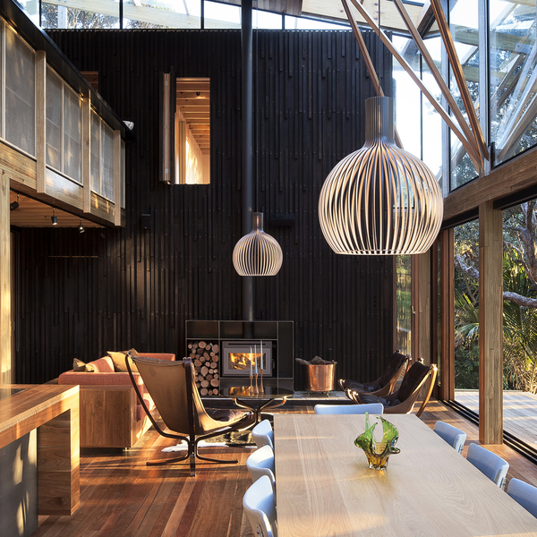
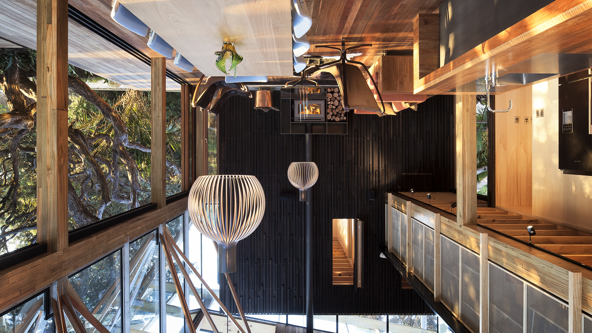
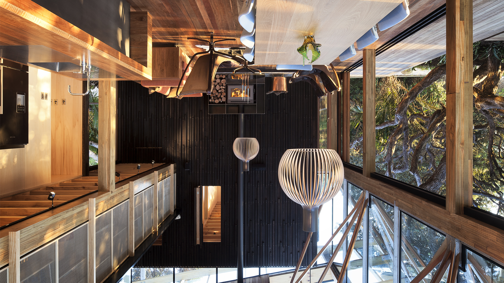
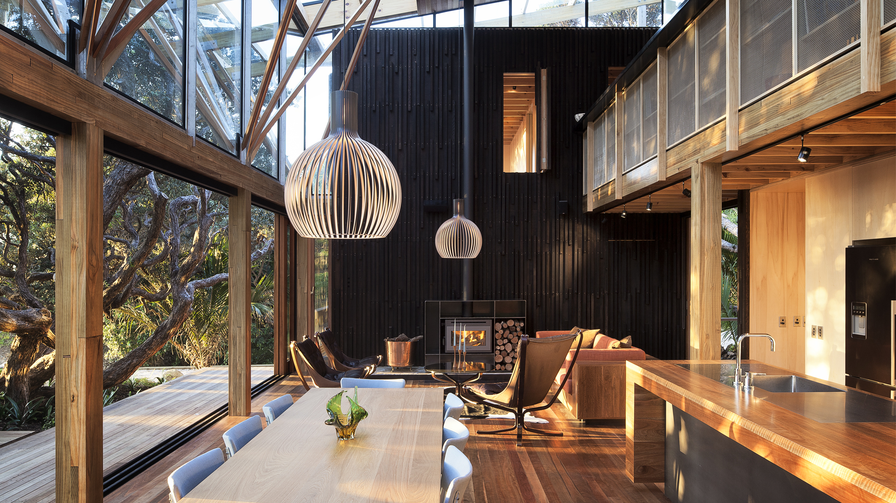

# DADI CDN

## Image manipulation examples

All images output in the examples below were created from this original image:

### Example #1: convert between formats

Convert from one format to another with quality control.

**Request**

`http(s)://your-domain.media/png/100/0/0/1920/1080/0/0/0/0/0/0/0/path/to/image.jpg`

**Converted to PNG**

### Example #2: blur

**Request**

`http(s)://your-domain.media/jpg/80/0/0/1920/1080/0/0/0/5/0/0/0/path/to/image.jpg`

**Output**

### Example #3: resize

Resized images by specifying width and height. There are three resizing styles:

* aspectfill: default. The resulting image will be exactly the specified size, and may be cropped
* aspectfit: scales the image so that it will not have to be cropped
* fill: squishes or stretches the image so that it fills exactly the specified size

**aspectfill**

`http(s)://your-domain.media/jpg/100/0/0/1920/1080/aspectfill/center/0/0/0/0/0/path/to/image.jpg`

**aspectfit**

`http(s)://your-domain.media/jpg/100/0/0/1920/1080/aspectfit/center/0/0/0/0/0/path/to/image.jpg`

**fill**

`http(s)://your-domain.media/jpg/100/0/0/1920/1080/fill/center/0/0/0/0/0/path/to/image.jpg`

### Example #4: rotate, flip, and mirror

Rotate and flip images, and combine the two to mirror.

**Rotate 90º**

`http(s)://your-domain.media/jpg/100/0/0/1920/1080/0/0/0/0/0/90/0/path/to/image.jpg`

**Rotate 180º**

`http(s)://your-domain.media/jpg/100/0/0/1920/1080/0/0/0/0/0/180/0/path/to/image.jpg`

**Flip**

`http(s)://your-domain.media/jpg/100/0/0/1920/1080/0/0/0/0/0/0/1/path/to/image.jpg`

**Flip + rotate 180 degrees = mirror**

`http(s)://your-domain.media/jpg/100/0/0/1920/1080/0/0/0/0/0/180/1/path/to/image.jpg`

